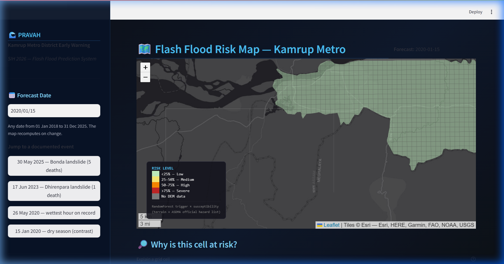
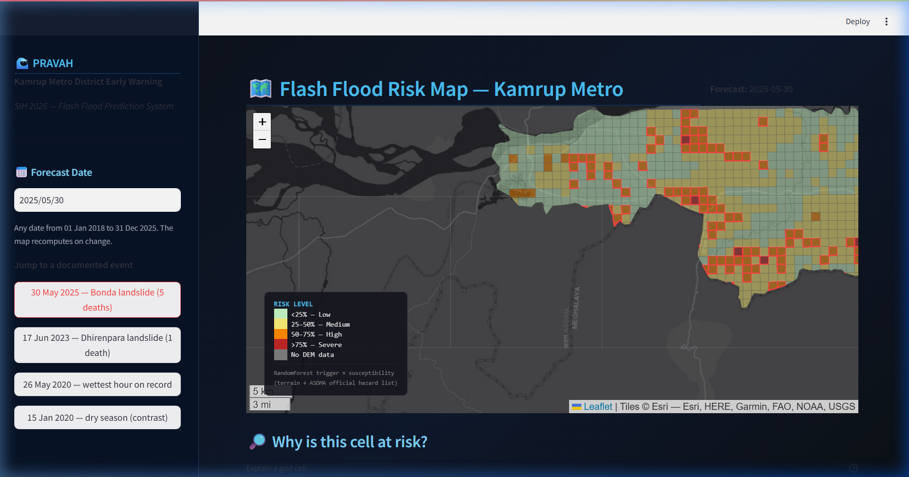
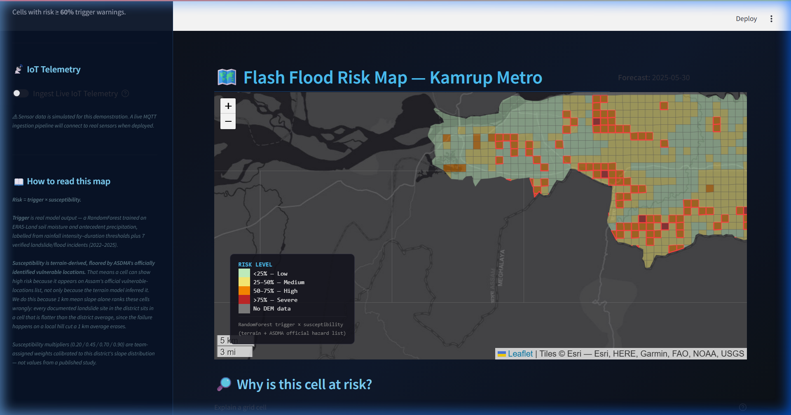

# PRAVAH

**Flash Flood Prediction System for Hilly Regions using Multi-Source Data**
Team Luit · Smart India Hackathon 2026 · Problem Statement PS26192 (Ministry of Home Affairs — Disaster Management)

*Hyper-local, proactive flash-flood and landslide early warning at 1 km resolution for hilly Guwahati.*

## Problem statement

Flash floods and rainfall-triggered slope failures in hilly terrain develop in hours, but
official warnings for districts like Kamrup Metropolitan are issued at district level and
often arrive too late to act on. There is no hyper-local, forward-looking picture of which
settlements are at risk on a given day. PRAVAH addresses that gap: it turns multi-source
rainfall, soil-moisture and terrain data into a per-cell risk forecast that can be issued
ahead of the event.

## What PRAVAH does

PRAVAH predicts rainfall-triggered flash-flood and slope-failure risk at **1 km grid
resolution** for the **Kamrup Metropolitan district** of Assam (Guwahati), and surfaces it
as an interactive risk map with a ranked early-warning list. The pilot grid covers **904
cells**, and risk can be rendered for any date from **2018-01-01 to 2025-12-31**. It
replaces the current district-level, after-the-fact warning paradigm with cell-level,
proactive alerts.

## Architecture

Risk for each cell and date is a product of one dynamic layer and one static layer:

```
risk[cell, date] = trigger_prob[weather_point(cell), date] * susceptibility_multiplier[cell]
```

- **Static susceptibility** is terrain-derived from 1 km mean slope, then *floored* to at
  least "High" for any cell containing an ASDMA officially identified vulnerable location
  or a verified historical incident. The class is mapped to a team-assigned multiplier
  (Low 0.20 / Moderate 0.45 / High 0.70 / Very High 0.90).
- **Dynamic trigger** is a scikit-learn RandomForest (`n_estimators=100`,
  `class_weight='balanced'`) trained on five weather-point-level features —
  `soil_moisture_0_7`, `soil_moisture_7_28`, `temp_c`, `api_3d`, `api_7d` (soil moisture at
  two depths, temperature, and the 3-day / 7-day Antecedent Precipitation Index). Labels
  come from rainfall intensity–duration thresholds plus verified landslide/flood incidents.
- Trigger probabilities are precomputed by `build_trigger_cache.py`, so the app renders any
  date as a lookup and a multiply, with no model call at demo time.

## Results and validation

Metrics reported are **PR-AUC** and **F1-macro**. ROC-AUC is deliberately not reported — it
is misleading at the ~9% positive-class rate of this dataset. Full detail, seed, and split
code are in [`docs/model_training_log.md`](docs/model_training_log.md).

**Split — episode-grouped, not a temporal cutoff.** Rainfall-threshold labels make
temporally adjacent hours near-duplicates, so runs of active hours are merged into storm
episodes (61 episodes) and the group key is `(year, episode_id)`.
`StratifiedGroupKFold(n_splits=5, shuffle=True, random_state=42)` is used, with fold 0 held
out as the test set. **0 episode groups appear on both sides** (asserted in code).

| | rows | episodes | positive rate |
|---|---|---|---|
| Train | 23,120 | 103 | 9.09% |
| Test | 5,777 | 24 | 9.09% |

| Model | PR-AUC | F1-macro |
|---|---|---|
| **RandomForest** (shipped — won on PR-AUC) | **0.8257** | **0.7640** |
| XGBoost | 0.7504 | 0.8307 |

Labels: 2,627 positive cell-hours (2,459 rainfall-threshold + 168 verified-incident)
against 26,270 stratified negatives (10:1), for a 28,897-row training set. 7 of 8 verified
incidents are inside the weather record and used; the 16 Jul 2026 Lal Ganesh incident is
excluded because it post-dates the record.

**ASDMA-overlap validation finding.** The official landslide-vulnerability assessment
underlying ASDMA's list dates to 2012-15 and was publicly reasserted in May 2022 — years
before five of the six fatal incidents in our validation set. All 6 incident-containing
grid cells fall within ASDMA's identified vulnerable zones.

## Setup

```bash
pip install -r requirements.txt
```

## Regenerating the data

Run from the repository root, in order:

```bash
python build_susceptibility.py     # -> data/processed/susceptibility_features.parquet
python build_trigger_cache.py      # -> data/processed/trigger_prob_daily.parquet
```

## Running the app

Run from the repository root:

```bash
streamlit run app/streamlit_app.py
```

The sidebar provides a forecast-date selector, one-click jumps to documented events, a
risk-threshold slider for the warning list, and an "Ingest Live IoT Telemetry" toggle. The
main pane shows the full-width 1 km risk map and, below it, the ranked early-warning list
and the per-cell explanation panel.

## Visual walkthrough


*Risk map for 15 Jan 2020 (dry-season contrast) — the whole district sits in the Low band.*


*Risk map for 30 May 2025 — High and Severe cells (orange/red) concentrate along the hill zones on a documented landslide date.*


*Active early-warning panel — 904 cells monitored, 142 above the 50% threshold, with the top-10 highest-risk cells listed.*


*"Why is this cell at risk?" — final risk, trigger probability, susceptibility class, and each feature's value against its historical monthly median.*


*Simulated live IoT telemetry — 5 virtual hill-site sensors streaming rainfall, soil moisture and water level; a real MQTT feed drops into the same panel.*


*Sidebar "How to read this map" disclosure — the risk formula, what is model output versus the official-hazard floor, and the multiplier caveat, all stated up front.*

## Known limitations

- **Weather resolution.** Open-Meteo's ERA5-Land archive is natively ~9 km resolution;
  weather fields are nearest-neighbour-downscaled onto the 1 km grid, not genuine 1 km
  weather.
- **Simulated IoT telemetry.** No public village-level sensor network exists in India. The
  IoT panel demonstrates the ingestion interface a real MQTT feed would drop into; the data
  is simulated and disclosed as such in the UI.
- **Team-assigned susceptibility multipliers.** The 0.20 / 0.45 / 0.70 / 0.90 weights are
  calibrated to this district's slope distribution, not taken from a published study.
- **Partial DEM coverage.** 93 of the 904 cells lack DEM coverage; they get multiplier 0.0
  and are rendered as grey "No Data", not as genuine low risk.
- **Single-district scope.** The system is built and validated for Kamrup Metropolitan
  only.

## Tech stack

Python · pandas · numpy · geopandas · rasterio · scikit-learn · XGBoost · SHAP · Streamlit ·
Folium · matplotlib · paho-mqtt (simulated feed)

## Team

Team Luit — Smart India Hackathon 2026.

*(add team member names)*
